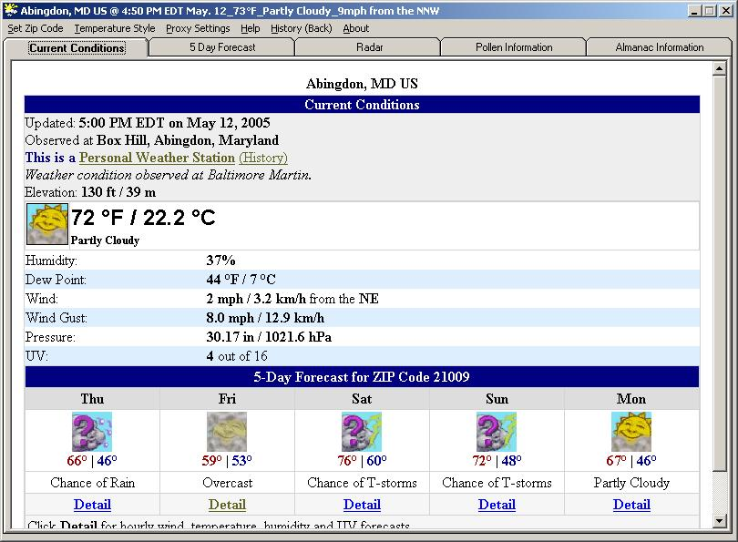

## Weather Application \- Updated

### Description

Firstly, Thanks Thomas Swift, for getting me back into this application. This code grabs the weather from wunderground.com as well as radar images and other data and creates web pages on the local machine to display the weather for the zip code of your choice. It is still a work in development, but thought I would share what is completed. The ads are removed and just the pertinent information is shown. When the form is minimized a little form pops up woth current weather icon and the temperature. I also included a proxy setting just in case you are behind one. If you are you may need to restart the app after setting your proxy.

Let me know how bad it is, comments are sprinkled throughout.

Thanks for looking,

Later

Larry

** Updated **

I have basically rewritten the parsing code for this app and corrected most of the issues that were in existence, including the directories used for the storage of the files. I have also added an alert function which grabs the latest updates and checks every 5 minutes, also changes the mini-mode background color to red when alerts exist. I have done a lot of mods on what the app does with the weather. I have also corrected the xml parsing for current conditions. Thanks again Tom!

** Update **
 
### More Info
 

             |
---                |---
**Submitted On**   |2006-07-31 08:59:38
**By**             |[Larry Myers](https://github.com/Planet-Source-Code/PSCIndex/blob/master/ByAuthor/larry-myers.md)
**Level**          |Beginner
**User Rating**    |4.3 (13 globes from 3 users)
**Compatibility**  |VB 6\.0
**Category**       |[Internet/ HTML](https://github.com/Planet-Source-Code/PSCIndex/blob/master/ByCategory/internet-html__1-34.md)
**World**          |[Visual Basic](https://github.com/Planet-Source-Code/PSCIndex/blob/master/ByWorld/visual-basic.md)
**Archive File**   |[Weather\_Ap201034812006\.zip](https://github.com/Planet-Source-Code/larry-myers-weather-application-updated__1-60506/archive/master.zip)

